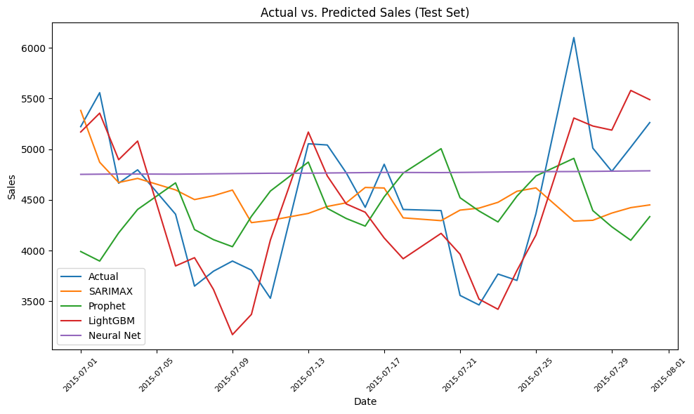

# Rossmann Store Sales Forecasting

This repository demonstrates how to forecast store-level sales for the 
[Rossmann Store Sales](https://www.kaggle.com/competitions/rossmann-store-sales) 
competition data using four different modeling approaches:

1. **SARIMAX (statsmodels)**  
2. **Prophet (Meta/Facebook Prophet)**  
3. **LightGBM (Gradient Boosted Trees)**  
4. **Simple Neural Network (Keras/TensorFlow)**  

We compare these methods using **Root Mean Squared Percentage Error (RMSPE)** on a time-based split.

---

## Project Structure

```text
rossmann-sales-forecasting/
├── data/                          <-- Place train.csv, test.csv, store.csv (NOT in GitHub)
├── figures/                       <-- Visualizations (prediction plots, etc.)
├── Rossmann_Sales_Comparison.ipynb  <-- Main Jupyter/Colab notebook
├── requirements.txt               <-- Dependencies
├── LICENSE                        <-- Open-source license (optional)
└── README.md                      <-- This file
```

---

## Getting the Data

Because of licensing and large file sizes, we **do not** include the raw Rossmann dataset in this repo.

1. **Sign in** to [Kaggle](https://kaggle.com/).  
2. Navigate to the [Rossmann Store Sales competition](https://www.kaggle.com/competitions/rossmann-store-sales).  
3. **Download** the following files:
   - `train.csv`
   - `test.csv`
   - `store.csv`
4. Create a folder called `data/` in the root of this repository and place the downloaded CSV files there.

---

## How to Use

You can use this project in **two different ways**:

---

### 🔹 Option 1 – Run on Google Colab (Recommended for Beginners)

No setup required. Just click below to open and run the notebook in Google Colab:

[](https://colab.research.google.com/drive/1iITWQHe0wK2meSt0XjT7lxTzRXf4gEwN)

> ⚠️ Be sure to upload the Kaggle data (`train.csv`, `test.csv`, `store.csv`) into the `data/` folder after launching the notebook.

---

### 🔹 Option 2 – Clone and Run Locally

1. **Clone this repository:**

   ```bash
   git clone git@github.com:zhangxijing97/rossmann-sales-forecasting.git
   cd rossmann-sales-forecasting
   ```

2. **Install dependencies:**

   ```bash
   pip install -r requirements.txt
   ```

3. **Download the data** from the [Kaggle Rossmann competition](https://www.kaggle.com/competitions/rossmann-store-sales) and place it in the `data/` folder:

   ```
   rossmann-sales-forecasting/
   └── data/
       ├── train.csv
       ├── test.csv
       └── store.csv
   ```

4. **Run the notebook:**

   ```bash
   jupyter notebook Rossmann_Sales_Comparison.ipynb
   ```

---

## Model Summary

The notebook trains and evaluates:

1. **SARIMAX** – A classical time-series model with weekly seasonality.  
2. **Prophet** – Meta/Facebook’s open-source library for time-series forecasting.  
3. **LightGBM** – A gradient boosting framework optimized for performance on tabular data.  
4. **Neural Network** – A simple Keras/TensorFlow feedforward network with two hidden layers.

**Key points**:
- Minimal feature engineering is demonstrated (day-of-week, promotions, etc.).  
- The best model is often LightGBM, but results vary based on feature engineering and hyperparameter tuning.

---

## Results & Visualization

The notebook calculates **RMSPE** on a hold-out time period (e.g., July–Aug 2015), and compares models:

```
RMSPE Results:
  SARIMAX:    0.1527
  Prophet:    0.1631
  LightGBM:   0.0891
  NeuralNet:  0.1851
```

### 📊 Actual vs. Predicted Sales

<p align="center">
  
</p>

LightGBM visually and quantitatively outperformed the other models.

---

## Contributing

Feel free to open **issues** or **pull requests** to improve feature engineering, hyperparameter tuning, or to add advanced models (Transformers, advanced ensembles).

---

## License

This repository can be distributed under the terms of the [MIT License](LICENSE).  
(You may replace it with your preferred open-source license.)

---

### Acknowledgments

- [Kaggle Rossmann Store Sales](https://www.kaggle.com/competitions/rossmann-store-sales) for the dataset.  
- [Statsmodels](https://www.statsmodels.org/), [Prophet](https://github.com/facebook/prophet), 
  [LightGBM](https://github.com/microsoft/LightGBM), 
  [TensorFlow](https://www.tensorflow.org/), and the open-source community.